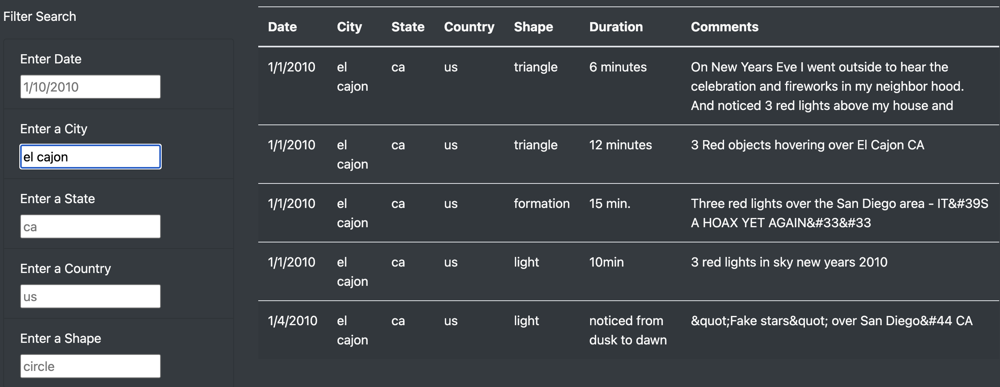

# UFOs

## Overview of the analysis:
The purpose of the project was to create a webpage and dynamic table to allow users to filter for multiple criteria to provide a in-depth analysis of UFO sightings by date, city, state, country, and shape.

## Results:
To perform a search, users enter filter criteria into filter input boxes. When they hit the Enter/Return button, the table will update with only the filtered rows of data. 

## Summary:
One drawback of this webpage is that it does not update as new sightings are reported.
To make the website better we could use Splinter and Beautifulsoup to to webscrape and update the data table with new sightings and to add news and stories about new UFO sightings.